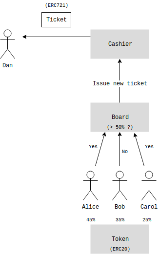
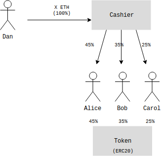

# WhaleChat DAO

WhaleChat operates as a [Decentralized Autonomous Organization (DAO)](https://en.wikipedia.org/wiki/Decentralized_autonomous_organization).

### Revenue flow

The revenue is distributed by smart contracts and governed by voting of the token holders. The diagrams below illustrate how this is done in terms of revenue flow:

1. The majority of token holders vote to issue a new ticket with specific characterisics (price, expirty date, etc.)

2. A new ticket is created and the contract waits for somebody to buy it.

3. Someone buys the ticket for the correspoding amount of ether.

4. The ether is then distributed among token holders proportionally to their share in the total token supply.

Note that `WHALE` tokens are ERC20-compliant and therefore can be bought and sold as any other ERC20 token. The same applies to tickets which are ERC721-compliant tokens.
