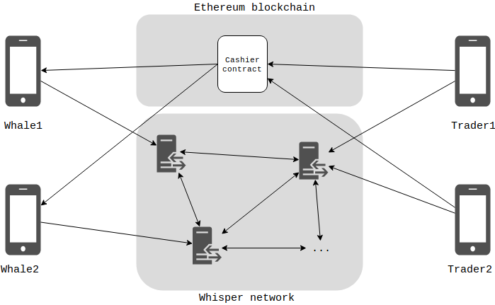

# Documentation

### Architecture

The platform consists of a mobile app, smart contracts running on the Ethereum blockchain, servers running the [Whisper protocol](https://github.com/ethereum/wiki/wiki/Whisper) and a server to store asset proofs, users in rooms, etc.



All chat communications are end-to-end encrypted using [Secp256k1 with the ECDSA algorithm](https://en.bitcoin.it/wiki/Secp256k1) and [NaCl Networking and Cryptography library](https://en.wikipedia.org/wiki/NaCl_(software)). The first time the app is run, it creates a cryptographic identity with which every message's recipient identity is verified. Messages are relayed using the [Whisper protocol](https://github.com/ethereum/wiki/wiki/Whisper).

WhaleChat is currently available for Android only.


## Proof of Wallet Ownership

The Proof of Wallet Ownership is a cryptographic proof that allows a WhaleChat user to prove that he owns a wallet without storing the private key of that wallet in the WhaleChat app. The proof consists of a message containing the user's WhaleChat identity public key which has been signed by the private key of the user's wallet and, in turn, signed by the user's WhaleChat identity private key.

```
Proof of wallet ownership =
(2) WhaleChat Identity private key signs { 
    (1) Wallet private key signs {
        Message containing WhaleChat identity public key
    }
}
```

WhaleChat uses [secp256k1 elliptic curve with the ECDSA](https://en.bitcoin.it/wiki/Secp256k1), just like the major cryptocurrencies do (e.g. Bitcoin, Ethereum, etc.).

The signature **(1)** proves that the owner of the wallet agrees to link its assets to the WhaleChat identity.
The signature **(2)** proves that the owner of the WhaleChat identity agrees to link the identity with wallet assets.

In order for the platform to accept a proof of wallet ownership both signatures need to be valid. If any of the signatures is invalid, the proof is rejected.
Valid proofs are shown in the app so any user can manually validate it as well.

Note that the assets can be not just cryptocurrencies but also any crypto asset that can be stored in the wallet (e.g. ERC20 or ERC721 tokens for Ethereum)
