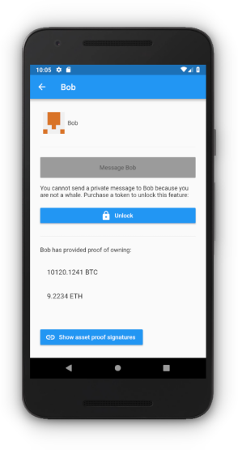
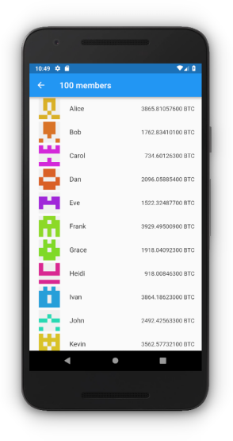
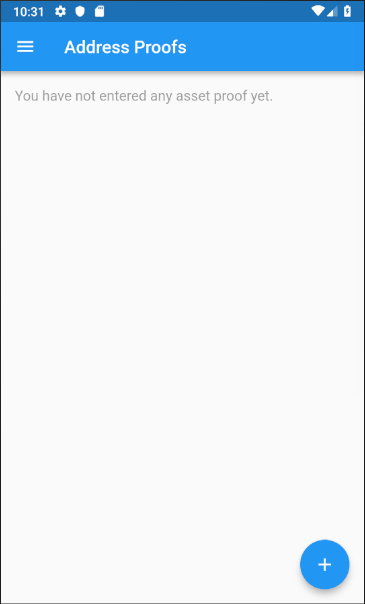
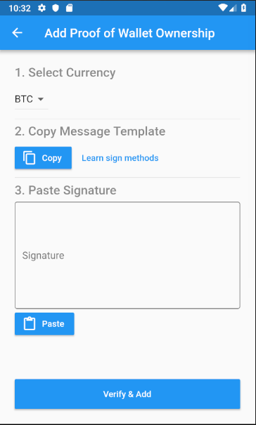
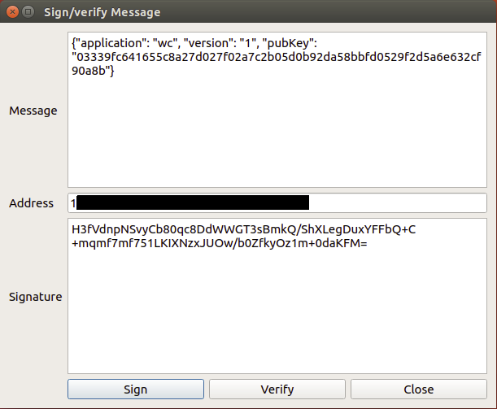
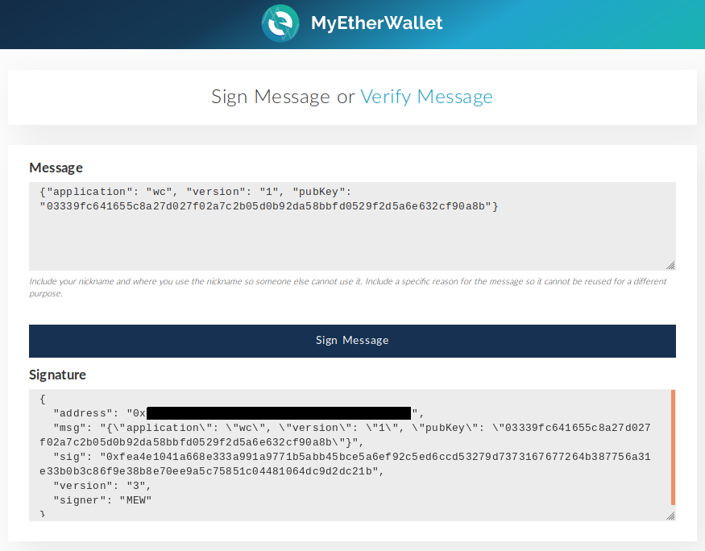
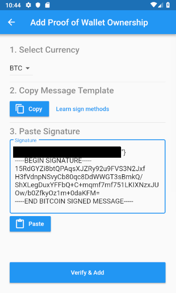
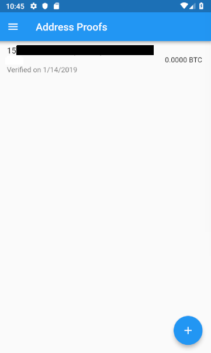
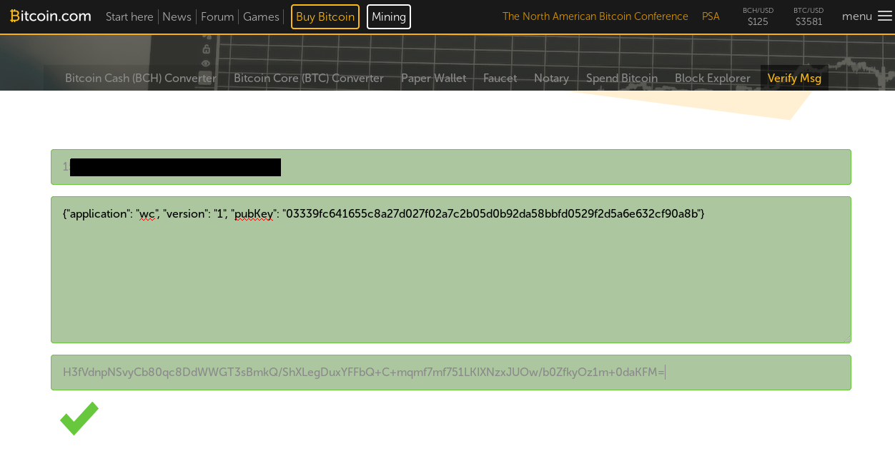

# WhaleChat

WhaleChat is a decentralized communication platform that allows [crypto whales](https://en.bitcoinwiki.org/wiki/Whales) to chat anonymously and securely with other whales and companies by providing a cryptographic proof of the ownership of their crypto assets without storing their private keys in the app. This is achieved with a novel digital signature scheme called [Proof of Wallet Ownership](./Documentation.md#Proof-Of-Wallet-Ownership).

Several chat rooms are provided, the access to them being restricted by a minimum amount of crypto funds that the user needs to prove to possess. For example: only users owning more than 1000 BTC can join the room. Additionally, the platform allows the possibility to contact whales for a fee so that anyone can buy a *ticket* and use it to advertise services to the whale users inside the app (for example, over-the-counter (OTC) trading of cryptocurrency and digital assets).

WhaleChat operates as a [Decentralized Autonomous Organization (DAO)](./DAO.md). All business logic is governed by a smart contract which is controlled by `WHALE` token holders. The revenue from the ticket sales is distributed to the token holders proportionally to their share in the total token supply. Other actions, such as issuance of new tickets or smart contract upgrades, are voted and approved by a majority of token holders.

 

The following links contain more information on the app [technical details](./Documentation.md) and the [DAO](./DAO.md).

# How to use it?

## As a whale

1. Go to the Asset Proofs screen in the WhaleChat app. Tap on the (+) button to add a new proof.

2. Select the currency of your wallet. Tap on the **Copy** button to copy the message containing your WhaleChat identity public key. This message needs to be signed with your wallet's private key.

3. Sign the message.

For Bitcoin, you can use Electrum as follows:

a. Right-clik on your wallet addresses among your list of addresses.

b. Click on **Sign/Verify message**.

c. Paste the message and click on **Sign**.

d. Copy and save the signature.

For Ethereum, you can use MyEtherWallet as follows:

a. Go to [MyEtherWallet Sign Message website](https://www.myetherwallet.com/signmsg.html).

b. Unlock your wallet using your method of choice.

c. Paste the message and click on **Sign**.

d. Copy and save the signature.

4. Paste the signature in the app. Note that the you need to follow the standard format.

5. Tap on **Verify & Add**. If the signature is valid, the app will show a confirmation message and the new proof will be added in the list of proofs.

## To contact whales

To contact whales you need to purchase a ticket. A ticket is an ERC721 token that gives the owner the right to publish a message inside the app for whales to read it.

Currently, a ticket can only be purchased directly calling to the function `buyTicket` of the `Cashier` smart contract. Unfortunately, there is currently no user interface for that but we plan to implement one soon as mentioned in the [Roadmap](#Roadmap).

## How to manually verify a proof

The signed messages can be verified by copying them on a wallet or website that supports signature verification for the currency of the wealthy wallet.

This is an example of how to verify the signature on a website for Bitcoin:
https://tools.bitcoin.com/verify-message/

For Ethereum, [MyEtherWallet Sign Message website](https://www.myetherwallet.com/signmsg.html) can be used.

## Roadmap

This is a high-level overview of our development plan. More details will be added soon.

- Auction-based ticket issuance.
- Support for asset proof of more cryptocurrencies and ERC20 /ERC721 tokens.
- UX for `WHALE` token and DAO management.
- Desktop client

In the long-term, we aim to further decentralize the platform implementing:
- Whisper protocol nodes incentivation scheme.
- Support for GPG signatures.

# Contact

[info@whalechat.club](mailto:info@whalechat.club)
